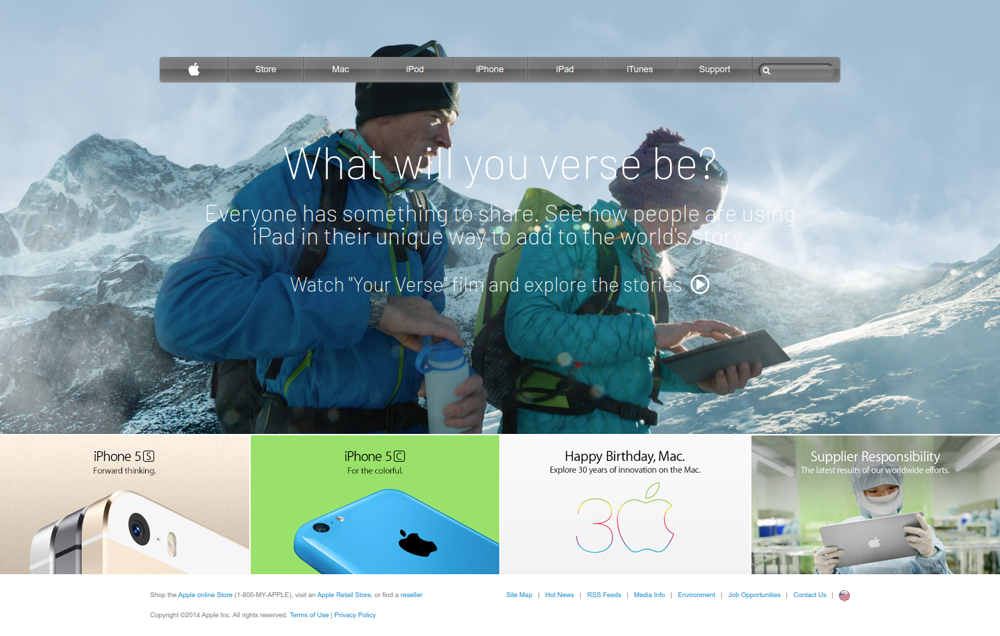

# BUILDING WITH BACKGROUND AND GRADIENTS
This project is about cloning old version of the Apple website home page

## Screenshot

## Built With

- HTML
- CSS
- Fontawesome
  ​

## Live Demo

​
[Live Demo Link](https://rawcdn.githack.com/mugberto/old-apple-web-homepage-clone/0945089bfad73bb4da8b904b21eff6498825e430/index.html)
​

## Getting Started

​
**Clone the repo on your system, find the index.html file and open with your browser**
​

## Author
​
#### 👤 **Hubert MUGABO**
​
- Github: [@mugberto](https://github.com/mugberto)
- Twitter: [@mugberto](https://twitter.com/mugberto)
- Linkedin: [mugberto](https://www.linkedin.com/in/hubert-mugabo-23144b6a/)

 ​
## �� Contributing

Contributions, issues and feature requests are welcome!
​
Feel free to check the [issues page](https://github.com/mugberto/old-apple-web-homepage-clone/issues).
​

## Show your support

Please, give a ⭐️ if you like this project!
​

## Acknowledgments

- Fontawesome
- Our Stand up teams
- Microverse TSE

  ​
## �� License
​
This project is [MIT](lic.url) licensed.